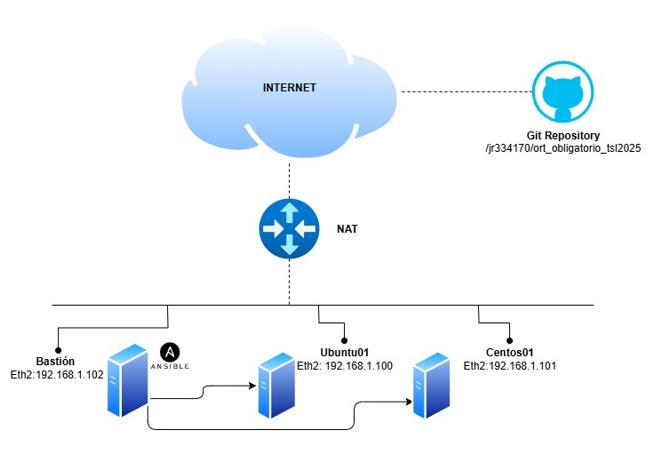
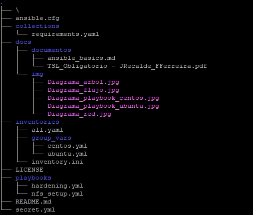
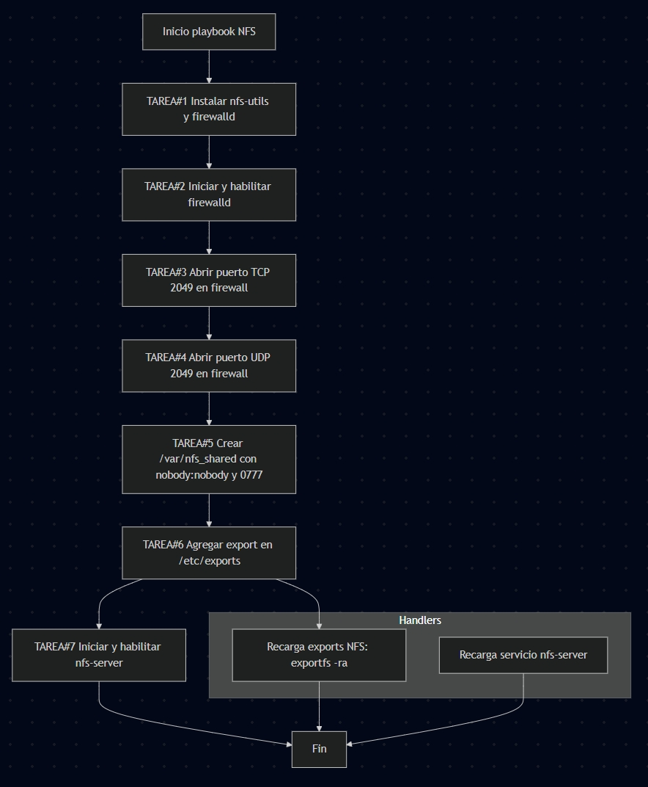
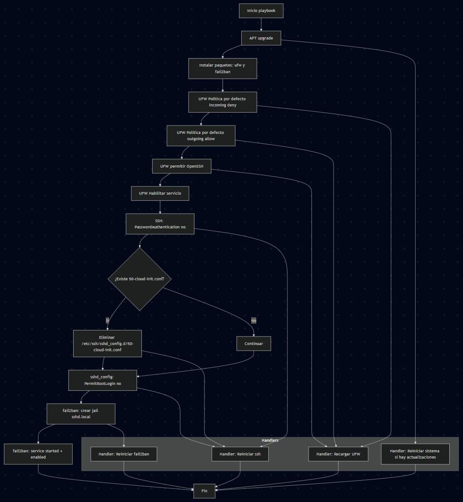

# Preparación de ambiente

# En el equipo Bastión o Controller, crear nuevo usuario en nuestro caso utilizamos "sysadmin" con permisos de sudo.

$sudo useradd -m -s /bin/bash sysadmin

$sudo passwd sysadmin

$sudo usermod -aG wheel sysadmin

# Instalar ANSIBLE

$sudo dnf install -y ansible-core

# Instalación de modulo requerido para Playbook Ubuntu UFW

$ansible-galaxy collection install community.general

# Generar clave pública y agregarlo al Centro de confianza de GIT

$ssh-keygen

# Para ver la clave pública y poder pegarla en los settings de Github

$cat ~/.ssh/id_rsa.pub

Pegar clave pública y añadirla a Settings > SSH Keys en cuenta Github

# Copiar la clave pública de tu Bastión hacia los Servidores, en nuestro caso 192.168.1.100 y 192.168.101

ssh-copy-id sysadmin@192.168.1.100
ssh-copy-id sysadmin@192.168.1.101

# Instalar GIT:
$sudo dnf install git

# Hacer el GIT Clone, del repositorio

$git clone git@github.com:jr334170/ort_obligatorio_tsl2025.git

# Instalar ANSIBLE-GALAXY, para ejecución de modulos, etc según requisitos

$ansible-galaxy install -r collections/requirements.yaml

# Chequear que se haya creado correctamente el arbol de directorios y archivos.

$tree

# Tarea 3 AD-HOC

-Listar todos los usuarios en servidor Ubuntu

$ansible ubuntu -m command -a "cut -d: -f1 /etc/passwd"

-Mostrar el uso de memoria en todos los servidores
$ansible all -m command -a "free -h"

-Que el servicio chrony esté instalado y funcionando en servidor Centos

$ansible centos -m shell -a "dnf install -y chrony && systemctl enable --now chronyd" --become --ask-become-pass

# Tarea 4 Playbooks

# Ejecución de los Playbooks

Centos:

 $ansible-playbook -i inventories/inventory.ini playbooks/nfs_setup.yml --become --extra-vars "@secret.yml" --ask-vault-pass

# Flujo del playbook

Ubuntu:

 $ansible-playbook -i inventories/inventory.ini playbooks/hardening.yml --become --extra-vars "@secret.yml" --ask-vault-pass

# Flujo del playbook

